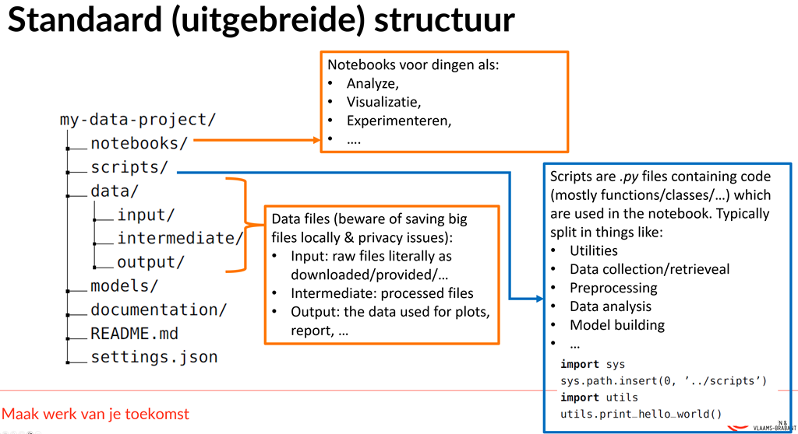

<!-- TOC -->
* [Introduction](#introduction)
* [Copy this structure - TODO - remove after initial setup](#copy-this-structure---todo---remove-after-initial-setup)
* [Folder structure](#folder-structure)
  * [data](#data)
    * [input](#input)
    * [intermediate](#intermediate)
    * [output](#output)
  * [documentation](#documentation)
  * [models](#models)
  * [notebooks](#notebooks)
  * [scripts](#scripts)
  * [Additional files](#additional-files)
    * [.gitattributes](#gitattributes)
    * [.gitkeep](#gitkeep)
    * [.gitignore](#gitignore)
    * [environment.yml](#environmentyml)
    * [README.md](#readmemd)
    * [settings.json](#settingsjson)
* [Project information - TODO](#project-information---todo)
* [Resources - TODO](#resources---todo)
<!-- TOC -->

> "Torture the data, and it will confess to anything" – Ronald Coase

# Introduction
This repo was made for the Data Science course from AB Syntra, Numpy project: https://github.com/ypottiez/Numpy-Project
Data and code can be freely used an redistributed with or without changes, no license applied.

# Copy this structure - TODO - remove after initial setup
After copying this structure execute these steps:

- Check and customize .gitignore
- Check and customize .gitattributes for Git LFS
- Execute 'git lfs install' on your local machine in the directory of your project
- Clean up README.md file and add project specific information
- Remove and add Table of contents chapters => when using Visual Studio Code, you can use *Markdown All in One*, this plugin will automatically update your table of contents after saving your file

> [!CAUTION]
> Do not forget to remove this chapter.

# Folder structure
Below you will find more information on how the project folder structure was set-up and where to find and store the appropriate files.

## data
Data files can be found in this folder structure in the correct sub-folder as described in the next sub-chapters.

### input
Raw/unchanged files as provided or downloaded.
Changes to dataset will not be saved here to prevent mistakes from happening.

### intermediate
Processed files will be stored here like files that are cleaned and/or transformed.

### output
Data that does not need processing anymore but can directly be used.
Reports/plots/... can also be stored as final products.

## documentation
Additional information and guides to help people get started.
Slides, PDFs, User Stories, UML diagrams, ... can be stored here as well.

## models
Information concerning models. Can be .json files with hyperparameters of the model or finished models, ONNX files, etc...

## notebooks
In this folder we save Jupyter notebooks used for analysis, visualization and experimentation.

## scripts
Re-usable python libraries like:

- Utilities
- Data collection/retrieval
- Preprocessing
- Data analysis
- Model building
- ...

 ## Additional files
 In this chapter we are discussing files that are situated in your project root folder and other folders.

### .gitattributes
Defines which files should be tracked by Git LFS (Large File Storage).
This is useful for large files like datasets, models, etc...
Execute 'git lfs install' on your local machine in the directory of your project to activate Git LFS.

### .gitkeep
Git does not track empty folders, to prevent this we can add a .gitkeep file to the folder.
This file can be removed after adding files to the folder.

### .gitignore
Because we are hosting our files on a Git repository, we use a .gitignore files so that temporary files are not checked in.
This can be generated by Github while initializing the repository, you can use [gitignore.io](https://www.toptal.com/developers/gitignore/) or create one yourself. 

### environment.yml
Contains the information about the conda environment.
This file can be used to create a new environment with the same packages as the original environment.
Execute `conda env create -f environment.yml` to create the environment.
Use `conda activate syntra_minimal` to activate the environment.

### README.md
Markdown file with information about the project, contains the information you are reading now.

 ### settings.json
 In here you can put application/script related parameters.
 Extracting these parameters makes it easier to switch environments.

 # Project information - TODO
 The purpose of this project is to find a random image and create a series of demanded and chosen manipulations as described in asignment.pdf (see documentation folder)

 # Resources - TODO
 Add resources used in the project

 - Github markdown: [guide](https://docs.github.com/en/get-started/writing-on-github/getting-started-with-writing-and-formatting-on-github/basic-writing-and-formatting-syntax)
 - Gitignore generator: [gitignore.io](https://www.toptal.com/developers/gitignore/)